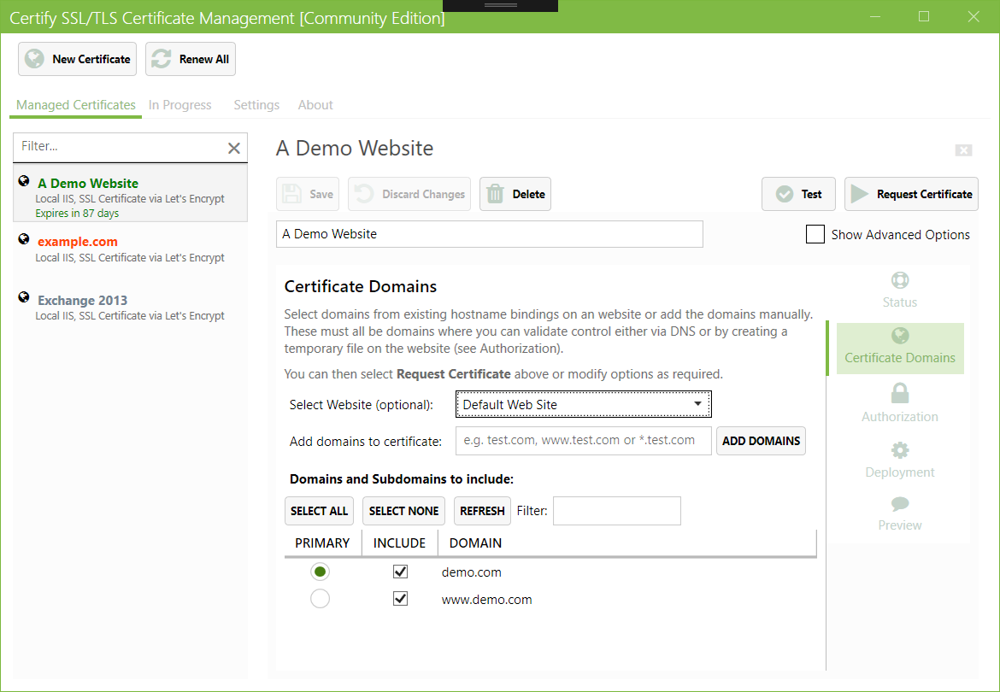

# Certify The Web - Certificate Manager UI for Windows

- Home page for downloads, info and support : [https://certifytheweb.com/](https://certifytheweb.com/)
- Documentation can be found at: [https://docs.certifytheweb.com](https://docs.certifytheweb.com)
- Community Discussions: [https://community.certifytheweb.com](https://community.certifytheweb.com)
- Changelog (release notes): https://certifytheweb.com/home/changelog

The SSL/TLS Certificate Management GUI for Windows, powered by [Let's Encrypt](https://letsencrypt.org/) and other ACME certificate authorities. This app makes it easy to automatically request, install and continuously renew free certificates for Windows/IIS or for any other services which requires a domain certificate.  

**Certify The Web is used by many thousands of organisations to manage millions of certificates each month** and is the perfect solution for administrators who want visibility of certificate management for their domains. Centralised dashboard status reporting is also available.

## Features include:
- See more details: https://certifytheweb.com/home/features
- Easy certificate requests & automated SSL bindings (IIS)
- Fetch certificates from ACME Certificate Authorities including Let's Encrypt, BuyPass Go and ZeroSSL
- Automatic renewal using a background service, with configurable renewal frequency.
- Preview mode to see which actions the app will perform (including which bindings will be added/updated)
- SAN support (multi-domain certificates)
- Single domains, multiple-domains (SAN) and wildcard certificates (*.example.com)
- Http or DNS challenge validation.
	- Built-in Http Challenge Server for easier configuration of challenge responses
	- DNS Validation via over 26 supported APIs (including Azure DNS, Alibaba Cloud, AWS Route53, Cloudflare, DnsMadeEasy, GoDaddy, OVH, SimpleDNSPlus)
- Stored Credentials (API access keys etc. protected by the Windows Data Protection API)
- Optional Pre/Post request deployment tasks and scripting for advanced deployment (**Exchange, RDS, multi-server, CCS, Apache, nginx, export, webhooks, Azure KeyVault etc**)

The Community edition is free, license keys are available for commercial organisations, users who wish to help fund development or users who require support.

## Requirements:
- Windows Server 2012 R2 or higher (.Net 4.6.2 or higher), 64-bit
----------
Quick Start (IIS users)
----------
1. Download from [https://certifytheweb.com/](https://certifytheweb.com/) and install it. Chocolatey users can alternatively `choco install certifytheweb`.
2. Click 'New Certificate', optionally choose your IIS site (binding hostnames will be auto detected, or just enter them manually). Save your settings and click 'Request Certificate'
3. All done! The certificate will renew automatically.

Users with more complex requirements can explore the different validation modes, deployment modes and other advanced options.

https://docs.certifytheweb.com

