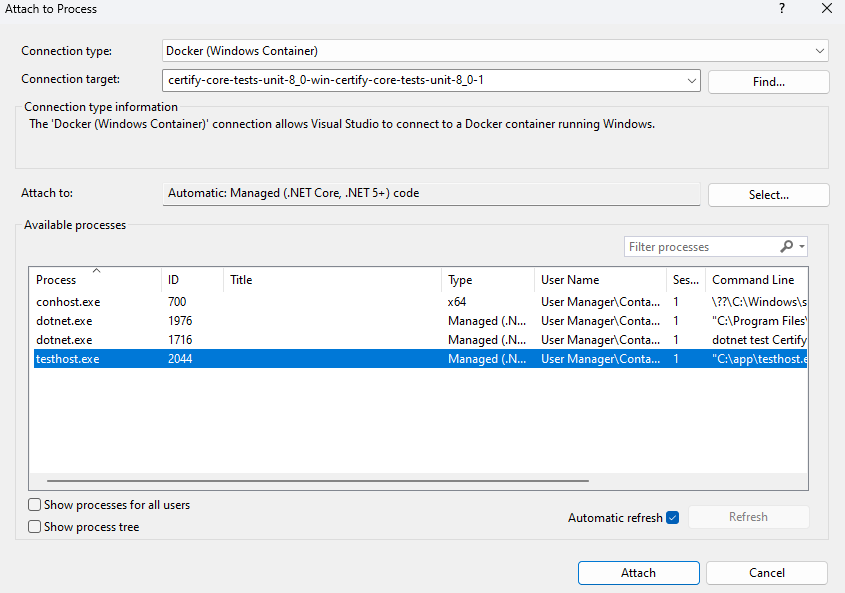
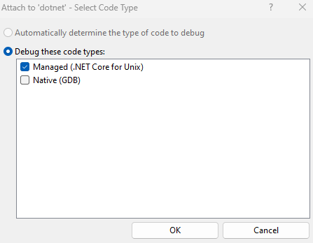

# Certify Core Unit Test Docker Images and Containers

## Building Certify Core Unit Test Docker Images

To build the Docker Images for the Certify Core Unit Tests, first navigate to `certify\src\Certify.Tests\Certify.Core.Tests.Unit` in a console window or Visual Studio's Developer Powershell Panel

### Linux Images

To build the Linux images, use the following Docker build commands (make sure Docker Desktop is switched to Linux containers):

```
// For .NET Core 8.0
docker build ..\..\..\..\ -t certify-core-tests-unit-8_0-linux -f .\certify-core-tests-unit-8_0-linux.dockerfile
```

### Windows Images

To build the Windows images, use the following Docker build commands (make sure Docker Desktop is switched to Windows containers):

```
// For .NET 4.6.2
docker build ..\..\..\..\ -t certify-core-tests-unit-4_6_2-win -f .\certify-core-tests-unit-4_6_2-win.dockerfile -m 8GB

// For .NET Core 8.0
docker build ..\..\..\..\ -t certify-core-tests-unit-8_0-win -f .\certify-core-tests-unit-8_0-win.dockerfile -m 8GB

// For the step-ca-win image
docker build . -t step-ca-win -f .\step-ca-win.dockerfile
```


Since the context built for the Docker Daemon is quite large for the Certify images in Windows (depending on the size of your Certify workspace), you may need to run this in a Powershell terminal outside of Visual Studio with the IDE and other memory-heavy apps closed down (especailly if you have low RAM).


## Running Certify Core Unit Test Containers with Docker Compose

### Linux Test Runs

To run the Linux Tests in Docker, use the following Docker Compose command:

```
docker compose -f linux_compose.yaml up -d
```

To stop the Linux Tests in Docker, use the following Docker Compose command:

```
docker compose -f linux_compose.yaml down -v
```

### Windows Test Runs

To run the Windows Tests in Docker, use the following Docker Compose command:

```
// For .NET 4.6.2
docker compose --profile 4_6_2 -f windows_compose.yaml up -d

// For .NET Core 8.0
docker compose --profile 8_0 -f windows_compose.yaml up -d
```

To stop the Windows Tests in Docker, use the following Docker Compose command:

```
// For .NET 4.6.2
docker compose --profile 4_6_2 -f windows_compose.yaml down -v

// For .NET Core 8.0
docker compose --profile 8_0 -f windows_compose.yaml down -v
```

### Debugging Tests Running in Containers with Docker Compose in Visual Studio

Within each test Docker Compose file are commented out lines for debugging subsections of the Certify Core Unit Test code base.

To run an individual class of tests, uncomment the following section of the corresponding Docker Compose file, with the name of the test class you wish to run following `ClassName=`:

```
  entrypoint: "dotnet test Certify.Core.Tests.Unit.dll -f net8.0 --filter 'ClassName=Certify.Core.Tests.Unit.CertifyManagerAccountTests'"
```

To run an individual test, uncomment the following section of the corresponding Docker Compose file, with 
the name of the test you wish to run following `Name=`:

```
  entrypoint: "dotnet test Certify.Core.Tests.Unit.dll -f net8.0 --filter 'Name=TestCertifyManagerGetAccountDetailsDefinedCertificateAuthorityId'"
```

To run tests using the Visual Studio debugger, first ensure that you have the `Containers` window visible (`View -> Other Windows -> Containers`)

Then, uncomment the following section of the corresponding Docker Compose file you wish to run:
```
  environment:
     VSTEST_HOST_DEBUG: 1
```

After starting the Docker Compose file with the `up` command, the container for the Unit Tests will show in the logs a message like this, showing the debug process to attach to (this may take a second while it waits for the health check of the Step-CA container):

```
Host debugging is enabled. Please attach debugger to testhost process to continue.
Process Id: 2044, Name: testhost
Waiting for debugger attach...
Process Id: 2044, Name: testhost
```

To attach to the process, right-click on the Unit Test container in the Visual Studio Container window, and select `Attach To Process`. Visual Studio may download the Debug tool to your container if missing.

Visual Studio will then bring up a new window showing the running Processes on the selected container. Double-click the Process with the matching ID number from the logging.



For Linux containers, you may additionally have to select the proper code type for debugging in the following window (Always choose `Managed (.NET Core for Unix)`):



The Visual Studio's debugger will then take a moment to attach. Once ready, you will need to click the `Continue` button to start test code execution.

**Be sure to uncomment any debugging lines from the compose files before committing changes to the `certify` repo.**

## Running Certify Core Unit Tests with a Base Docker Image (No Building)

Since building a custom image can take time while doing local development, you can also use a the base images referenced in the Dockerfiles for this project to run your code on your machine in a container.

To do this, first navigate to `certify\src\Certify.Tests\Certify.Core.Tests.Unit` in a console window or Visual Studio's Developer Powershell Panel.

### Running Certify Core Unit Tests with a Linux Base Image

**Note: CertifyManagerAccountTests tests will not work properly unless a Docker container for step-ca has been started with the hostname `step-ca`**

To run all of the Certify Core Unit Tests in a Linux container, use the following command:

```
docker run --name core-tests-unit-8_0-linux --rm -it -v ${pwd}\bin\Debug\net8.0:/app -w /app mcr.microsoft.com/dotnet/sdk:8.0 dotnet test Certify.Core.Tests.Unit.dll -f net8.0
```

To run a specific class of Certify Core Unit Tests in a Linux container, use the following command, substituting the Class Name of the tests after `--filter "ClassName=`:

```
docker run --name core-tests-unit-8_0-linux --rm -it -v ${pwd}\bin\Debug\net8.0:/app -w /app mcr.microsoft.com/dotnet/sdk:8.0 dotnet test Certify.Core.Tests.Unit.dll -f net8.0 --filter "ClassName=Certify.Core.Tests.Unit.DnsQueryTests"
```

To run a single Certify Core Unit Test in a Linux container, use the following command, substituting the Test Name of the tests after `--filter "Name=`:

```
docker run --name core-tests-unit-8_0-linux --rm -it -v ${pwd}\bin\Debug\net8.0:/app -w /app mcr.microsoft.com/dotnet/sdk:8.0 dotnet test Certify.Core.Tests.Unit.dll -f net8.0 --filter "Name=MixedIPBindingChecksNoPreview"
```

To run Certify Core Unit Tests with Debugging in a Linux container, use the following command, add `-e VSTEST_HOST_DEBUG=1` as a `docker run` parameter like so:

```
docker run --name core-tests-unit-8_0-linux --rm -it -e VSTEST_HOST_DEBUG=1 -v ${pwd}\bin\Debug\net8.0:/app -w /app mcr.microsoft.com/dotnet/sdk:8.0 dotnet test Certify.Core.Tests.Unit.dll -f net8.0"
```

### Running Certify Core Unit Tests with a Windows Base Image

**Note: CertifyManagerAccountTests tests will not work properly unless a Docker container for step-ca-win has been started with the hostname `step-ca`**

To run all of the Certify Core Unit Tests in a Windows container, use the following command:

```
// For .NET 4.6.2
docker run --name core-tests-unit-4_6_2-win --rm -it -v ${pwd}\bin\Debug\net462:C:\app -w C:\app mcr.microsoft.com/dotnet/sdk:8.0-windowsservercore-ltsc2022 dotnet test Certify.Core.Tests.Unit.dll -f net462

// For .NET Core 8.0
docker run --name core-tests-unit-8_0-win --rm -it -v ${pwd}\bin\Debug\net8.0:C:\app -w C:\app mcr.microsoft.com/dotnet/sdk:8.0-windowsservercore-ltsc2022 dotnet test Certify.Core.Tests.Unit.dll -f net8.0
```

See the above Linux examples to see how to run tests selectively or with debugging enabled.
